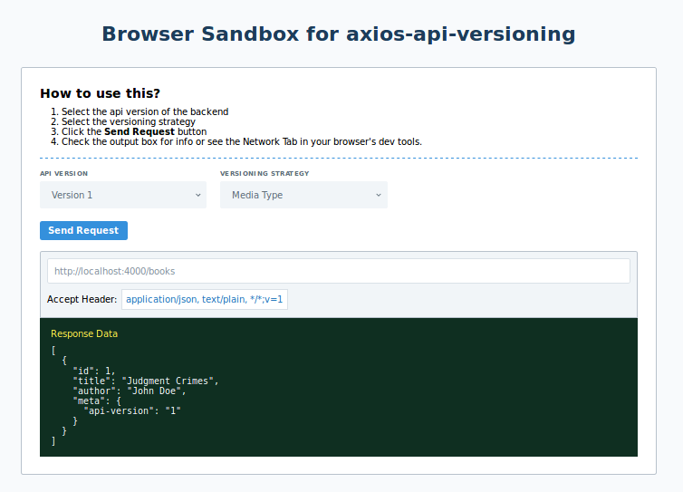

# axios-api-versioning

[](https://npmjs.org/package/axios-api-versioning "View this project on npm")
[](https://greenkeeper.io/)
[](https://circleci.com/gh/Weffe/axios-api-versioning/tree/master)

Add easy to manage api versioning to [axios](https://github.com/axios/axios)

## Online Demo

[](https://codesandbox.io/s/lx83688vyq?fontsize=14&hidenavigation=1&view=preview)

[Visit Online Demo](https://codesandbox.io/s/lx83688vyq?fontsize=14&hidenavigation=1&view=preview)

## Quick Start

### Install

<details open>
<summary>npm</summary>

```bash
npm install --save axios-api-versioning
```
</details>

<details open>
<summary>yarn</summary>

```bash
yarn add axios-api-versioning
```
</details>

### Example Usage

```javascript
import axios from 'axios';
import { withVersioning, VersioningStrategy } from 'axios-api-versioning';

// create an axios instance with versioning
// and versioning config
const client = withVersioning(axios, {
    apiVersion: '1.0.0',
    versioningStrategy: VersioningStrategy.QueryString
});

client.get('http://example.com', {
    // override default apiVersion
    apiVersion: '2.0.2',
    // override default versioningStrategy
    versioningStrategy: VersioningStrategy.MediaType
})
```

## TypeScript Support

TypeScript is supported! There's no need to install types for this package from the `@types` repository as they are provided by this package directly.

## Documentation

You can visit the online docs here: https://weffe.github.io/axios-api-versioning

## Example Projects

There are 2 example projects showcasing the usage of `axios-api-versioning`. 
You can check them out here:

1. [with-nodejs](./examples/with-nodejs)
2. [with-react-typescript](./examples/with-react-typescript)

## Changelog

You can view the changelog [here](./CHANGELOG.md).

## Related Projects

- https://github.com/Microsoft/aspnet-api-versioning

## License

MIT