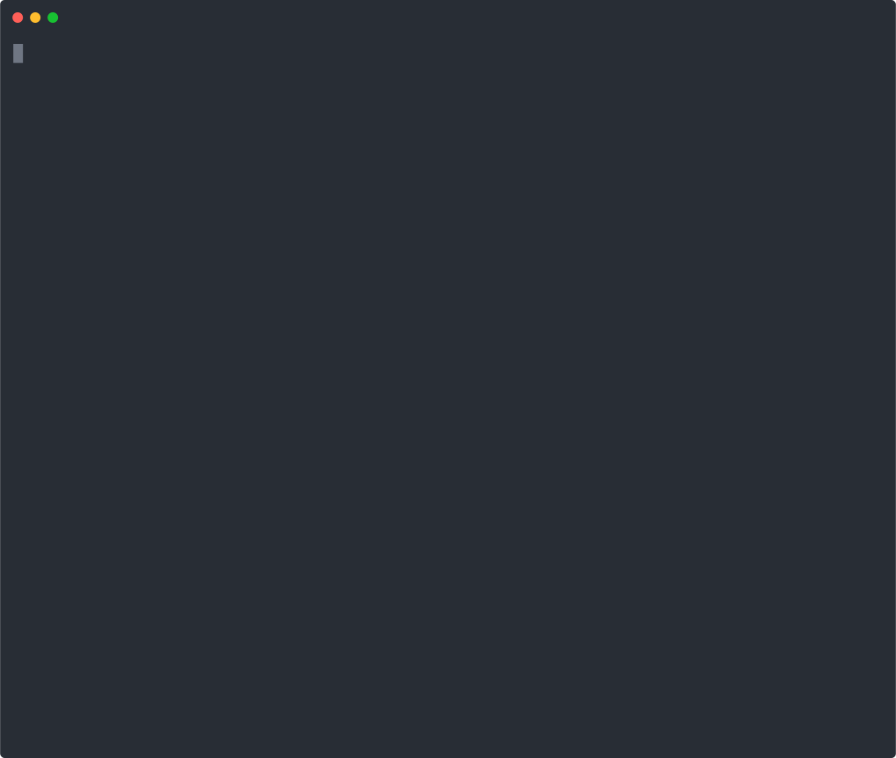

# Example: with-nodejs

This example shows how you could use `axios-api-versioning` in NodeJS.



## Quick Start

> Make sure you are inside the `examples/with-nodejs` folder before running any commands.

### 1. Install Dependencies

<details open>
<summary>npm</summary>

```bash
npm install
```
</details>

<details open>
<summary>yarn</summary>

```bash
yarn install
```
</details>

### 2. Run the program

<details open>
<summary>npm</summary>

```bash
npm start
```
</details>

<details open>
<summary>yarn</summary>

```bash
yarn start
```
</details>

### 3. View output in console