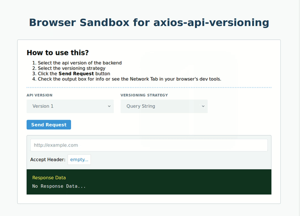

# Example: with-react-typescript

This example shows how you can use `axios-api-versioning` in a React App.



## Quick Start

> Make sure you are inside the `examples/with-react-typescript` folder before running any commands.

### 1. Install Dependencies

<details open>
<summary>npm</summary>

```bash
npm install
```
</details>

<details open>
<summary>yarn</summary>

```bash
yarn install
```
</details>

### 2. Start the dev server

<details open>
<summary>npm</summary>

```bash
npm start
```
</details>

<details open>
<summary>yarn</summary>

```bash
yarn start
```
</details>

### 3. Visit http://localhost:3000 

> The react app should automatically open in your browser but if it doesn't then visit the url manually.

## Overview

This is a sample sandbox project that shows real usage of how you could integrate `axios-api-versioning` in your project.
Even though it is a React App, the same structure inside `src/api.ts` can be used as inspiration in your own projects.